# error-envelope Architecture Guide

Visual guide to understanding when and how to use error-envelope in your Rust API.

## Table of Contents

- [The Three-Layer Error Model](#the-three-layer-error-model)
- [When to Use error-envelope](#when-to-use-error-envelope)
- [Error Flow Through Your Application](#error-flow-through-your-application)
- [Integration Patterns](#integration-patterns)
- [Client Benefits](#client-benefits)

---

## The Three-Layer Error Model

Most Rust APIs have three distinct error handling layers. Each layer has different requirements:

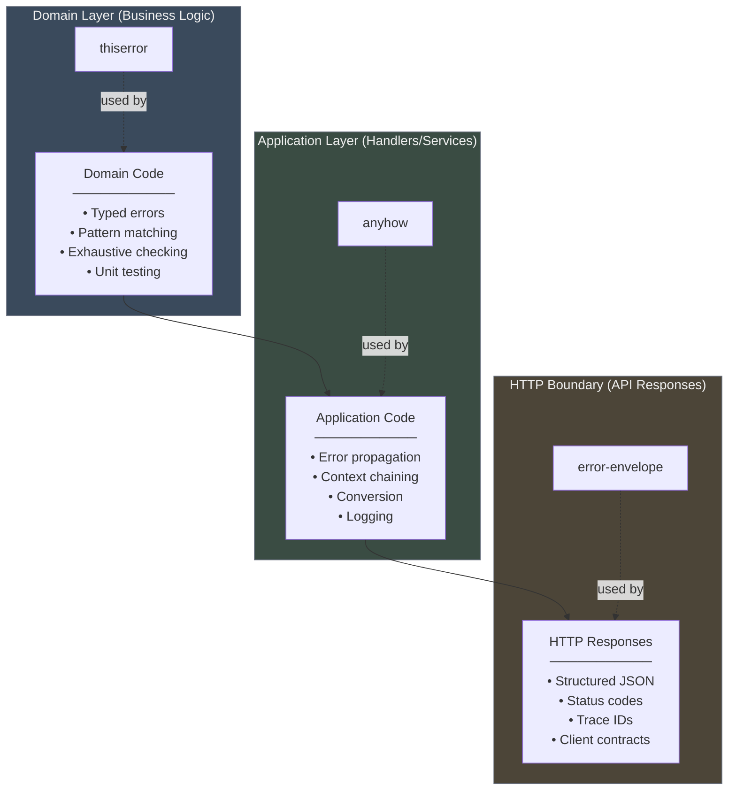

**error-envelope lives at the HTTP boundary.** It's the last stop before errors become JSON responses that clients consume.

---

## When to Use error-envelope

Use error-envelope when you need **consistent, structured HTTP error responses** across your API.

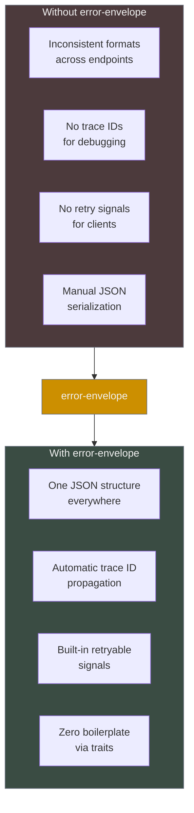

### Use Cases

**Perfect for:**
- REST APIs with multiple endpoints
- Services consumed by mobile apps
- Microservices with distributed tracing
- APIs with validation requirements
- Services that call downstream APIs

**Skip if:**
- Internal-only services (no external clients)
- gRPC or binary protocols (not HTTP/JSON)
- Single-endpoint services with simple errors
- Existing error standard you must maintain

---

## Error Flow Through Your Application

Here's how errors flow from your domain logic to HTTP responses:

```mermaid
sequenceDiagram
    participant Client
    participant Handler as Axum Handler
    participant Service as Business Logic
    participant Domain as Domain Layer
    participant DB as Database

    Client->>Handler: POST /bookings
    Handler->>Service: create_booking(dto)
    
    Service->>Domain: BookingRequest::try_from(dto)
    Domain-->>Service: ValidationError
    
    Service-->>Handler: anyhow::Error
    Handler->>Handler: Convert to error-envelope::Error
    Handler-->>Client: 400 Bad Request<br/>{code, message, details, trace_id}

    Note over Handler,Client: error-envelope creates<br/>structured JSON response

    rect rgb(58, 74, 92)
        Note over Handler: IntoResponse trait<br/>automatically converts<br/>Error to HTTP response
    end
```

### Code Example

```rust
use axum::Json;
use error_envelope::Error;
use anyhow::Result as AnyResult;

// Domain layer: typed errors
#[derive(thiserror::Error, Debug)]
enum BookingError {
    #[error("Check-in date must be in the future")]
    InvalidCheckIn,
    
    #[error("No rooms available for {0} guests")]
    NoAvailability(u8),
}

// Service layer: anyhow for flexibility
async fn create_booking(dto: BookingDto) -> AnyResult<Booking> {
    let booking = BookingRequest::try_from(dto)?;  // ValidationError -> anyhow
    let availability = check_availability(&booking).await?;  // BookingError -> anyhow
    Ok(save_booking(booking).await?)
}

// HTTP layer: error-envelope for structure
async fn handler(
    Json(dto): Json<BookingDto>
) -> Result<Json<Booking>, Error> {
    let booking = create_booking(dto).await
        .map_err(|e| Error::from(e))?;  // anyhow -> error-envelope
    Ok(Json(booking))
}
```

**Key transitions:**
1. Domain error → `anyhow` (via `?` operator)
2. `anyhow` → `error-envelope` (via `From<anyhow::Error>` with `anyhow-support` feature)
3. `error-envelope` → HTTP response (via `IntoResponse` with `axum-support` feature)

---

## Integration Patterns

### Pattern 1: Direct Usage (No Features)

Framework-agnostic. Manually serialize and write responses.

```rust
use error_envelope::Error;

fn handler() -> Result<String, Error> {
    if missing_auth() {
        return Err(Error::unauthorized("Missing token"));
    }
    Ok("success".to_string())
}

// Manual serialization
match handler() {
    Ok(data) => send_json(200, data),
    Err(e) => {
        let json = serde_json::to_string(&e)?;
        send_json(e.status, json)
    }
}
```

### Pattern 2: Axum Integration (axum-support feature)

Automatic HTTP response conversion via `IntoResponse` trait.

```rust
use axum::Json;
use error_envelope::Error;

async fn handler() -> Result<Json<User>, Error> {
    let user = find_user("123").await?;  // anyhow::Error converts automatically
    Ok(Json(user))
}

// Error automatically becomes:
// - HTTP response with correct status
// - JSON body with error envelope
// - X-Request-ID header (if trace_id set)
// - Retry-After header (if retry_after set)
```

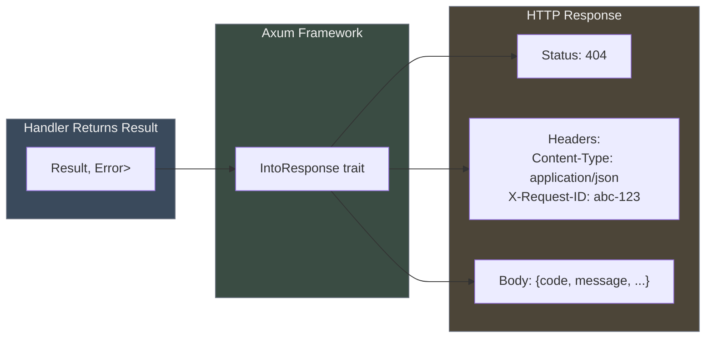

### Pattern 3: With anyhow (anyhow-support feature)

Seamless conversion from application-layer errors to HTTP errors.

```rust
use error_envelope::Error;
use anyhow::{Result, Context};

async fn handler() -> Result<Json<Data>, Error> {
    // All anyhow errors convert automatically via ?
    let config = load_config().await?;
    let data = fetch_data(&config).await
        .context("Failed to fetch data")?;
    Ok(Json(data))
}

// Any anyhow::Error becomes error-envelope::Error (Internal/500)
// with the error message preserved
```

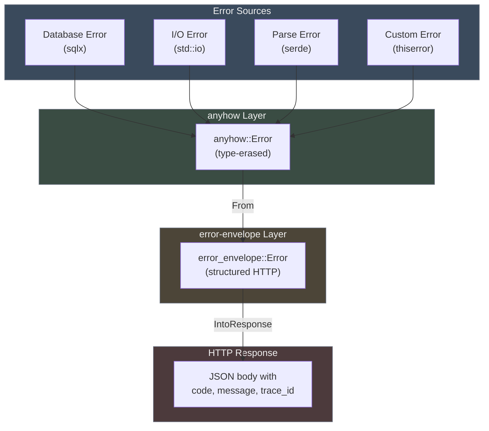

---

## Client Benefits

error-envelope makes life easier for API clients (web apps, mobile apps, CLI tools).

### Before: Inconsistent Error Handling

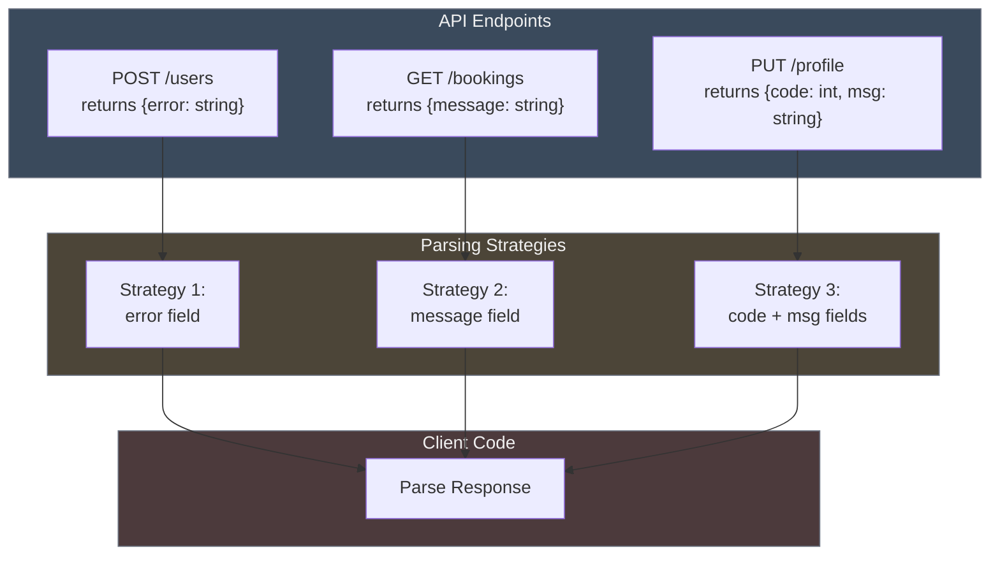

### After: One Parsing Strategy

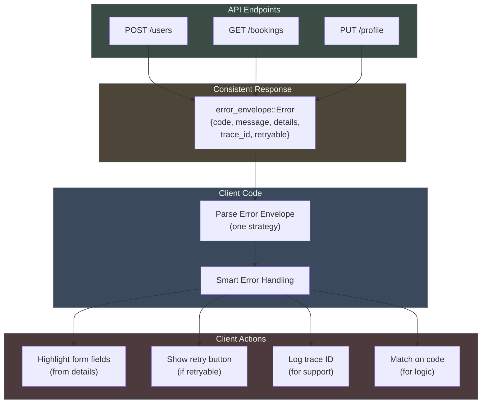

### Example: Mobile App Error Handler

```typescript
// TypeScript/React Native - one error handler for entire API
interface ErrorEnvelope {
  code: string;
  message: string;
  details?: { fields?: Record<string, string> };
  trace_id?: string;
  retryable: boolean;
}

function handleApiError(error: ErrorEnvelope, formRef: FormRef) {
  // Log trace ID for debugging
  if (error.trace_id) {
    console.error(`API Error [${error.trace_id}]:`, error.message);
  }

  // Handle validation errors
  if (error.code === "VALIDATION_FAILED" && error.details?.fields) {
    Object.entries(error.details.fields).forEach(([field, msg]) => {
      formRef.setFieldError(field, msg);  // Highlight specific inputs
    });
    return;
  }

  // Show retry for transient failures
  if (error.retryable) {
    showRetryDialog(error.message);
    return;
  }

  // Handle specific error codes
  switch (error.code) {
    case "UNAUTHORIZED":
      redirectToLogin();
      break;
    case "RATE_LIMITED":
      showRateLimitMessage(error.retry_after);
      break;
    default:
      showGenericError(error.message);
  }
}
```

**One function handles every API error** with field-level validation, trace IDs, and smart retry logic.

---

## Decision Tree: Do You Need error-envelope?

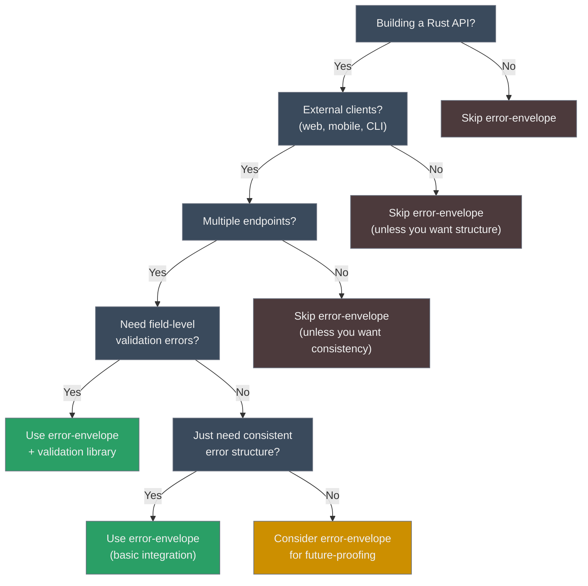

---

## Error Flow Through Your Application

### Example: Booking API

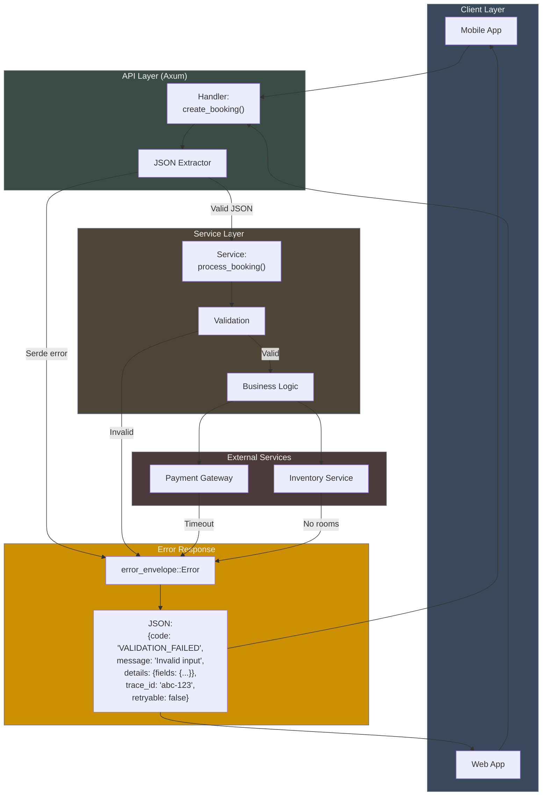

**Every error path converges to error-envelope** before reaching clients.

---

## Integration Patterns

### Pattern: Microservices with Distributed Tracing

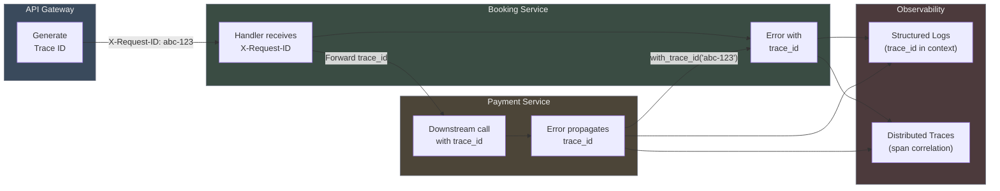

**Benefits:**
- Correlate errors across service boundaries
- Find failed requests in logs by trace ID
- Debug distributed transactions end-to-end
- Clients include trace IDs in bug reports

### Pattern: Rate Limiting with Retry-After

```mermaid
sequenceDiagram
    participant Client
    participant API
    participant RateLimiter

    Client->>API: POST /bookings (attempt 1)
    API->>RateLimiter: Check rate limit
    RateLimiter-->>API: Limit exceeded
    API-->>Client: 429 Rate Limited<br/>{code: "RATE_LIMITED",<br/>retryable: true,<br/>retry_after: "30s"}

    Note over Client: Wait 30 seconds<br/>(from retry_after)

    Client->>API: POST /bookings (attempt 2)
    API->>RateLimiter: Check rate limit
    RateLimiter-->>API: OK
    API-->>Client: 200 OK

    rect rgb(58, 74, 92)
        Note over API,Client: error-envelope provides<br/>retry_after duration<br/>and retryable flag
    end
```

**Code:**

```rust
use error_envelope::Error;
use std::time::Duration;

async fn handler() -> Result<Json<Data>, Error> {
    if is_rate_limited() {
        return Err(
            Error::rate_limited("Too many requests")
                .with_retry_after(Duration::from_secs(30))
                .with_trace_id(request_id)
        );
    }
    
    Ok(Json(process_request().await?))
}
```

**Client sees:**
```json
{
  "code": "RATE_LIMITED",
  "message": "Too many requests",
  "retryable": true,
  "retry_after": "30s",
  "trace_id": "abc-123"
}
```

---

## Comparison: Manual vs error-envelope

### Manual Error Handling (Before)

```rust
async fn handler() -> Result<Json<User>, StatusCode> {
    match find_user("123").await {
        Ok(user) => Ok(Json(user)),
        Err(e) => {
            // Lost all error context!
            // No trace ID, no structured details, no retry hint
            Err(StatusCode::INTERNAL_SERVER_ERROR)
        }
    }
}
```

**Problems:**
- No structured error details
- No trace IDs for debugging
- No retry signals for clients
- Loses error context
- Inconsistent across endpoints

### With error-envelope (After)

```rust
use error_envelope::Error;

async fn handler() -> Result<Json<User>, Error> {
    let user = find_user("123").await?;  // anyhow converts automatically
    Ok(Json(user))
}

// Automatic error response:
// {
//   "code": "INTERNAL",
//   "message": "Database connection failed",
//   "trace_id": "abc-123",
//   "retryable": false
// }
```

**Benefits:**
- Structured JSON with stable codes
- Automatic trace ID propagation
- Retry signals for transient failures
- Consistent format across all endpoints
- One line of code (`?` operator)

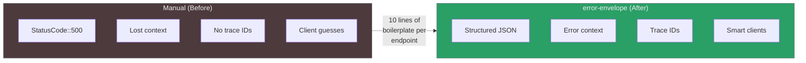

---

## Summary

**error-envelope is a thin layer at the HTTP boundary** that gives you:

1. **Consistency** - One error format across all endpoints
2. **Structure** - Machine-readable codes, human-readable messages, structured details
3. **Observability** - Trace IDs for distributed debugging
4. **Resilience** - Retry signals for transient failures
5. **Zero boilerplate** - `IntoResponse` trait handles serialization

**Use it when:**
- Building REST APIs with external clients
- Multiple endpoints need consistent errors
- You want field-level validation feedback
- Distributed tracing is important
- Client retry logic matters

**Skip it when:**
- Internal-only services (no external clients)
- Single-endpoint APIs with simple errors
- Using non-HTTP protocols (gRPC, etc.)
- Existing error standard you must maintain

**The key insight:** error-envelope doesn't replace thiserror or anyhow--it complements them by handling the HTTP boundary. Your domain still uses thiserror for typed errors, your application layer still uses anyhow for flexibility, and error-envelope handles the final conversion to structured HTTP responses.
