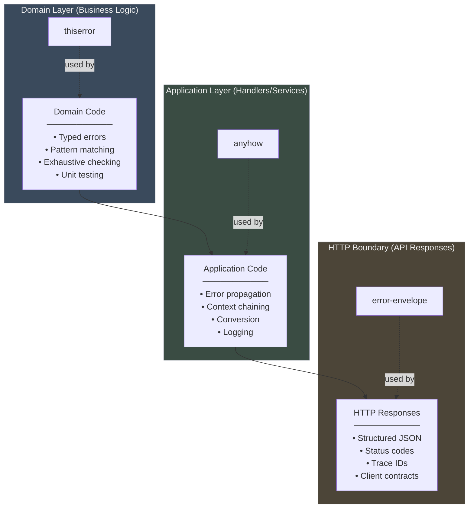
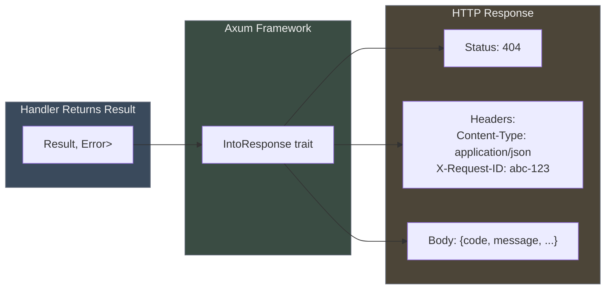
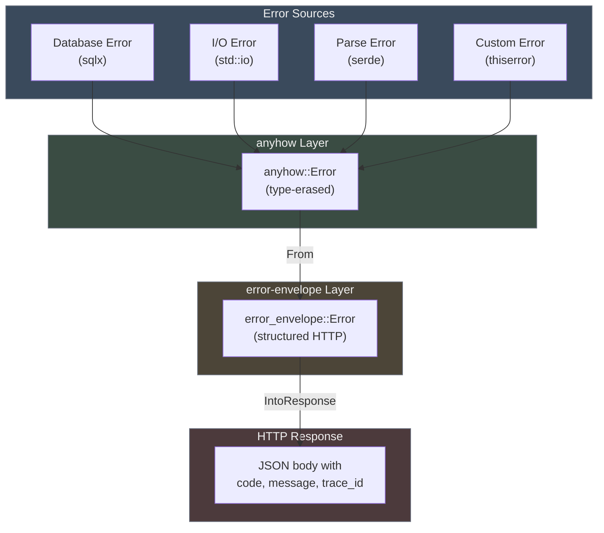
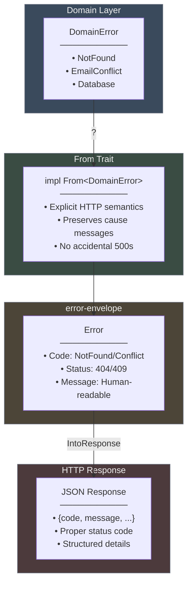

# error-envelope Architecture Guide

Visual guide to understanding when and how to use error-envelope in your Rust API.

## Table of Contents

- [The Three-Layer Error Model](#the-three-layer-error-model)
- [Integration Patterns](#integration-patterns)
- [Summary](#summary)

---

## The Three-Layer Error Model

Most Rust APIs have three distinct error handling layers. Each layer has different requirements:



**error-envelope lives at the HTTP boundary.** It's the last stop before errors become JSON responses that clients consume.


---

## Integration Patterns

### Pattern 1: Direct Usage (No Features)

Framework-agnostic. Manually serialize and write responses.

```rust
use error_envelope::Error;

fn handler() -> Result<String, Error> {
    if missing_auth() {
        return Err(Error::unauthorized("Missing token"));
    }
    Ok("success".to_string())
}

// Manual serialization
match handler() {
    Ok(data) => send_json(200, data),
    Err(e) => {
        let json = serde_json::to_string(&e)?;
        send_json(e.status, json)
    }
}
```

### Pattern 2: Axum Integration (axum-support feature)

Automatic HTTP response conversion via `IntoResponse` trait.

```rust
use axum::Json;
use error_envelope::Error;

async fn handler() -> Result<Json<User>, Error> {
    let user = find_user("123").await?;  // anyhow::Error converts automatically
    Ok(Json(user))
}

// Error automatically becomes:
// - HTTP response with correct status
// - JSON body with error envelope
// - X-Request-ID header (if trace_id set)
// - Retry-After header (if retry_after set)
```



### Pattern 3: With anyhow (anyhow-support feature)

Seamless conversion from application-layer errors to HTTP errors.

```rust
use error_envelope::Error;
use anyhow::{Result, Context};

async fn handler() -> Result<Json<Data>, Error> {
    // All anyhow errors convert automatically via ?
    let config = load_config().await?;
    let data = fetch_data(&config).await
        .context("Failed to fetch data")?;
    Ok(Json(data))
}

// Any anyhow::Error becomes error-envelope::Error (Internal/500)
// with the error message preserved
```



### Pattern 4: Domain Errors with thiserror (Recommended)

Explicit mapping from typed domain errors to HTTP semantics.

```rust
use error_envelope::{Code, Error};
use thiserror::Error as ThisError;

// Define domain errors with thiserror
#[derive(ThisError, Debug)]
pub enum DomainError {
    #[error("user not found")]
    NotFound,
    
    #[error("email already exists")]
    EmailConflict,
    
    #[error("database error")]
    Database(#[from] anyhow::Error),
}

// Map domain errors to HTTP errors
impl From<DomainError> for Error {
    fn from(e: DomainError) -> Self {
        match e {
            DomainError::NotFound =>
                Error::new(Code::NotFound, 404, "User not found"),
            DomainError::EmailConflict =>
                Error::new(Code::Conflict, 409, "Email already exists"),
            DomainError::Database(cause) =>
                Error::wrap(Code::Internal, 500, "Database failure", cause),
        }
    }
}

// Handlers use ? for automatic conversion
async fn handler() -> Result<Json<User>, Error> {
    let user = get_user().await?; // DomainError -> Error via From
    Ok(Json(user))
}
```



**Why this pattern?**

- **Explicit HTTP semantics** - You decide which domain errors map to which HTTP codes
- **No accidental 500s** - NotFound becomes 404, not Internal (unlike anyhow path)
- **Zero boilerplate** - Handlers use `?` just like with anyhow
- **Type safety** - Compile-time guarantee all domain errors are mapped

See [`examples/domain_errors.rs`](examples/domain_errors.rs) for complete example.


---

## Summary

**error-envelope is a thin layer at the HTTP boundary** that gives you:

1. **Consistency** - One error format across all endpoints
2. **Structure** - Machine-readable codes, human-readable messages, structured details
3. **Observability** - Trace IDs for distributed debugging
4. **Resilience** - Retry signals for transient failures
5. **Zero boilerplate** - `IntoResponse` trait handles serialization

error-envelope doesn't replace thiserror or anyhow--it complements them by handling the HTTP boundary. Your domain still uses thiserror for typed errors, your application layer still uses anyhow for flexibility, and error-envelope handles the final conversion to structured HTTP responses.
